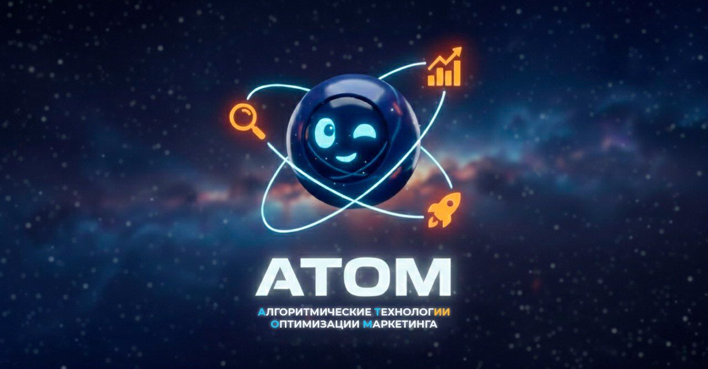

<!DOCTYPE html>
<html lang="ru">
<head>
<meta charset="UTF-8">
<meta name="viewport" content="width=device-width, initial-scale=1.0">
<title>VK Lead Machine — AI-отдел продаж 24/7</title>

</head>
<body>

<!-- ════════════════════════════════════════════
     NAVBAR
════════════════════════════════════════════ -->
<nav class="navbar">
  

    <a href="#" class="navbar-logo">
      
      

        
АТОМ

        
Интеграция ИИ в бизнес

      

    </a>
    
🚀 VK Lead Machine Pro

  

</nav>

<!-- ════════════════════════════════════════════
     HERO
════════════════════════════════════════════ -->
<section class="hero" style="padding-top: 64px;">
  

  

  

  

    

      <!-- Логотип АТОМ -->
      

        
      

      

        ⚡ АТОМ — Интеграция ИИ в бизнес
        🚀 VK Lead Machine Pro
      

      <h1 class="hero-title">
        Ваш отдел продаж 
        работает 24/7 без зарплаты
      </h1>

      

        Единая AI-система, которая <strong>сама находит клиентов</strong> во ВКонтакте, 
        <strong>сама пишет им</strong> и <strong>сама доводит до сделки</strong> — пока вы занимаетесь бизнесом
      

      

        

          
24/7

          
без выходных

        

        

          
500+

          
лидов в месяц

        

        

          
−90%

          
сокращение расходов на маркетинг

        

        

          
5 мин

          
реакция на ответ

        

        

          
ROI

          
с первого месяца

        

      

      

        прокрутите вниз, чтобы узнать детали
      

    

  

</section>

<!-- ════════════════════════════════════════════
     PAIN — СКОЛЬКО ВЫ ПЛАТИТЕ СЕЙЧАС
════════════════════════════════════════════ -->
<section class="pain-section">
  

    

      💸 Реальные цифры
      <h2 class="section-title">Сколько стоит искать клиентов по-старому?</h2>
      
Посчитайте, во сколько обходится стандартная команда для лидогенерации в VK

    

    

      

        👥
        <h3 class="pain-title">Команда сотрудников</h3>
        <ul class="pain-list">
          <li>SMM-менеджер 80 000 ₽/мес</li>
          <li>Контекстная реклама (Яндекс.Директ) от 50 000 ₽ на тесты</li>
          <li>Таргет VK Ads (риск слива бюджета) от 50 000 ₽/мес</li>
          <li>Копирайтер / Дизайнер 40 000 ₽/мес</li>
          <li>Потери на нецелевые клики (CPC 50–300 ₽) непредсказуемо</li>
          <li>Человеческий фактор, текучка, отпуска постоянно</li>
        </ul>
        

          🔴 Итого ежемесячно
          от 270 000 ₽
        

      

      

        🤖
        <h3 class="pain-title">VK Lead Machine</h3>
        <ul class="pain-list">
          <li>Анализирует аудиторию — сам ✓</li>
          <li>Находит горячих лидов — сам ✓</li>
          <li>Пишет комментарии — сам ✓</li>
          <li>Ведёт диалог в ЛС — сам ✓</li>
          <li>API & Хостинг (n8n + AI-модели) ~5 000–10 000 ₽/мес</li>
          <li>Зарплаты, реклама, агентства 0 ₽</li>
        </ul>
        

          🟢 Расходы ежемесячно
          ~15 000 ₽/мес
        

      

    

    <!-- Дополнительные боли -->
    

      

        
😤

        
Человеческий фактор

        
Менеджер устал — написал плохо. Встал не с той ноги — упустил тёплого лида. Заболел — воронка встала

      

      

        
⏰

        
Время ответа

        
Человек пишет ночью или в выходной — ответа нет. Остыл, ушёл к конкурентам. AI отвечает через 5 минут

      

      

        
📉

        
Непредсказуемость

        
Сотрудник уходит — теряете наработки, контакты, воронку. Система никуда не уходит и помнит всё

      

    

  

</section>

<!-- ════════════════════════════════════════════
     COMPARISON TABLE
════════════════════════════════════════════ -->
<section class="compare-section">
  

    

      📊 Сравнение
      <h2 class="section-title">Команда из 4 человек против одной системы</h2>
      
Факты без прикрас — цифры, которые говорят сами за себя

    

    

      

        
Параметр

        
👥 Команда людей

        
🤖 VK Lead Machine

      

      

        
💰 Ежемесячные расходы

        
от 270 000 ₽/мес

        
~15 000 ₽/мес (API + хостинг)

      

      

        
⏱️ Рабочие часы в месяц

        
~640 часов (8ч × 4 чел × 20 дней)

        
720 часов — всегда 24/7

      

      

        
🎯 Лидов в месяц (потенциал)

        
100–200 лидов

        
300–700 лидов

      

      

        
⚡ Скорость реакции на ответ

        
от 30 минут до нескольких часов

        
до 5 минут круглосуточно

      

      

        
📊 Аналитика эффективности

        
ручные отчёты, раз в неделю

        
Google Sheets в реальном времени

      

      

        
🎨 Качество текстов

        
зависит от настроения, усталости

        
одинаково высокое всегда

      

      

        
🔄 Масштабирование

        
нанять новых — ещё +100 000 ₽/мес

        
меняем лимит в Config — бесплатно

      

      

        
🏖️ Отпуска, больничные

        
обязательно оплачиваются по закону

        
не существуют

      

      

        
🧠 Запоминание контекста

        
может забыть, перепутать, потерять

        
полная история каждого диалога

      

      

        
📱 Работа в выходные

        
доп. оплата или отказ

        
пн = пт = вс = праздники — без разницы

      

      

        
👋 Риск увольнения / ухода

        
высокий, особенно менеджеры продаж

        
нулевой — система ваша навсегда

      

    

  

</section>

<!-- ════════════════════════════════════════════
     FUNNEL — КАК РАБОТАЕТ
════════════════════════════════════════════ -->
<section class="funnel-section">
  

    

      🔄 Воронка продаж
      <h2 class="section-title">От незнакомца до горячей заявки</h2>
      
Система проходит весь путь автоматически — от анализа рынка до момента, когда менеджер получает готового клиента

    

    

      

        
1

        

          
🔍 Изучает рынок и аудиторию

          

            AI анализирует ваш бизнес, продукт и целевую аудиторию. Автоматически генерирует десятки поисковых запросов, по которым ищет ВКонтакте людей, которым нужны именно ваши услуги. Использует данные Яндекс.Вордстат — самого большого поискового индекса рунета.
          

          

            Раз в сутки
            Яндекс.Вордстат
            AI-анализ
          

        

      

      

        
2

        

          
🎯 Находит тёплых лидов с AI-скорингом

          

            Каждые 15 минут система сканирует VK-группы с вашей целевой аудиторией. Для каждого активного пользователя AI выставляет оценку релевантности от 0 до 100 — учитывается активность, тематика постов, поведение в группах. В базу попадают только реально заинтересованные люди.
          

          

            Каждые 15 мин
            AI-скоринг 0–100
            Фильтрация мусора
          

        

      

      

        
3

        

          
✍️ Пишет нативные комментарии

          

            AI генерирует уникальный комментарий к каждому посту — под тему обсуждения, без рекламного tone-of-voice. Человек видит полезный ответ, а не спам. Это создаёт первый органический контакт, который не вызывает отторжения.
          

          

            Каждые 20 мин
            Нативный контент
            До 100 комментариев/день
          

        

      

      

        
4

        

          
💬 Переводит в личные сообщения

          

            Когда человек отвечает на комментарий — система мгновенно это замечает и начинает диалог в личке. Первое сообщение отправляется в тот же момент, пока интерес горячий. Конкуренты узнают об этом потенциальном клиенте только завтра.
          

          

            Каждые 10 мин
            Моментальная реакция
            До 20 новых диалогов/день
          

        

      

      

        
5

        

          
🏆 Доводит до заявки и передаёт менеджеру

          

            AI ведёт диалог по воронке продаж: установление контакта → выявление потребности → квалификация → закрытие. Помнит весь контекст разговора. Когда человек готов — отправляет уведомление менеджеру в Telegram с полным досье: кто, откуда, о чём говорили.
          

          

            Каждые 5 мин
            Воронка продаж
            Передача менеджеру
          

        

      

    

  

</section>

<!-- ════════════════════════════════════════════
     METRICS
════════════════════════════════════════════ -->
<section class="metrics-section">
  

    

      📈 Цифры системы
      <h2 class="section-title">Производительность, которую не купить за зарплату</h2>
    

    

      

        
🕐

        
8 760

        
часов работы в год

        
Сотрудник — 1 984 рабочих часа. Разница в 4,4 раза

      

      

        
🎯

        
500+

        
лидов в месяц (потенциал)

        
Зависит от ниши и аудитории. Средний менеджер — 80–120

      

      

        
⚡

        
&lt;5 мин

        
время реакции на ответ

        
Среднее время ответа менеджера — 47 минут по статистике HubSpot

      

      

        
🧠

        
100%

        
сохранность истории диалогов

        
Каждое сообщение, каждый контакт — в Google Sheets навсегда

      

      

        
📊

        
12

        
таблиц аналитики в реальном времени

        
Лиды, воронка, диалоги, статистика, ошибки — всё под контролем

      

      

        
🔄

        
5

        
параллельных AI-процессов

        
Анализ, парсинг, комментарии, мониторинг, диалоги — всё одновременно

      

    

    <!-- ROI BLOCK -->
    

      

        

          💰 Финансовая математика
          <h3 style="font-size: 32px; font-weight: 800; letter-spacing: -0.02em;">Окупаемость с первого месяца</h3>
        

        

          

            
❌ Традиционный маркетинг (в месяц)

            
270 000 ₽

            
ежемесячно × 12 = 3 240 000 ₽/год

            <ul class="roi-items">
              <li>👤 SMM-менеджер: 80 000 ₽</li>
              <li>📢 Контекстная / таргет реклама: 150 000 ₽</li>
              <li>✏️ Копирайтер / Дизайнер: 40 000 ₽</li>
              <li>💸 Нецелевые клики (CPC 50–300 ₽): слив</li>
              <li>🔄 Текучка, обучение, человеческий фактор</li>
              <li>📉 Стоимость лида в 3–5 раз выше</li>
            </ul>
          

          

            
VS

            
↓

            

              
3 млн

              
экономия в год

            

            
↓

            

              
−90%

              
сокращение расходов

            

          

          

            
✅ С VK Lead Machine (в месяц)

            
~15 000 ₽

            
API + хостинг n8n + AI-модели — и больше ничего

            <ul class="roi-items">
              <li>🤖 Зарплаты сотрудников: 0 ₽</li>
              <li>📢 Реклама и таргет: 0 ₽ (органика)</li>
              <li>✏️ Копирайтер / Дизайнер: 0 ₽ (делает ИИ)</li>
              <li>♾️ Работает бесконечно после настройки</li>
              <li>📊 Стоимость лида снижается в 3–5 раз</li>
              <li>🏆 Окупаемость внедрения: 1.5–3 месяца</li>
            </ul>
          

        

      

    

  

</section>

<!-- ════════════════════════════════════════════
     MODULES — ЧТО ВХОДИТ В СИСТЕМУ
════════════════════════════════════════════ -->
<section class="modules-section">
  

    

      🧩 Состав системы
      <h2 class="section-title">Два мощных модуля — одна непрерывная машина</h2>
      
Каждый модуль решает свою задачу. Вместе они создают замкнутую систему от анализа до продажи

    

    

      <!-- Module 1 -->
      

        

          
Модуль 01 · Разведка рынка

          🔬
          
Wordstat Intelligence

          
Понимает, как ваша аудитория ищет вас в интернете, и находит её там

        

        

          <ul class="module-features">
            <li>
              ▶
              <strong>Двойная семантика Яндекс + VK:</strong> анализирует ключи не только в Яндекс.Вордстат, но и внутри ВКонтакте — находит неочевидные запросы, по которым ваша аудитория ищет контент прямо в ленте
            </li>
            <li>
              ▶
              <strong>Попадание в рекомендации ВК:</strong> определяет идеальные ключи, хэштеги и структуру поста — система знает, какой контент алгоритм ВКонтакте продвигает в «Интересное» и раздел рекомендаций
            </li>
            <li>
              ▶
              <strong>SEO-индексация в Яндексе:</strong> оптимизирует посты под поисковые алгоритмы — ваш контент появляется в органической выдаче Яндекса по широким запросам и создаёт «вечный» трафик без рекламного бюджета
            </li>
            <li>
              ▶
              Автоматически генерирует 150–300 ключевых запросов под ваш бизнес — без участия маркетолога и SEO-специалиста
            </li>
            <li>
              ▶
              Анализирует топ-200 конкурентных постов по engagement rate — определяет идеальное время, формат и длину поста для максимального охвата
            </li>
            <li>
              ▶
              Обновляется каждые 6 часов — база ключей всегда актуальна, тренды не пропускаются, алгоритмы платформ учитываются в реальном времени
            </li>
          </ul>
        

      

      <!-- Module 2 -->
      

        

          
Модуль 02 · Автоматические продажи

          🚀
          
VK Sales Autopilot

          
Находит клиентов, устанавливает контакт, ведёт переговоры — сам

        

        

          <ul class="module-features">
            <li>
              ▶
              Сканирует тысячи VK-групп с вашей аудиторией каждые 15 минут — находит активных пользователей
            </li>
            <li>
              ▶
              AI оценивает каждого пользователя по 10+ параметрам — до вас доходят только реально заинтересованные
            </li>
            <li>
              ▶
              Пишет нативные комментарии под каждый пост — они выглядят как живое общение, а не реклама
            </li>
            <li>
              ▶
              Моментально переводит в личку тех, кто ответил — пока интерес горячий, конкуренты ещё не знают о лиде
            </li>
            <li>
              ▶
              Ведёт полноценный диалог по воронке продаж — rapport, интерес, квалификация, закрытие на заявку
            </li>
            <li>
              ▶
              Отправляет менеджеру в Telegram готового горячего лида с историей переписки и контактными данными
            </li>
          </ul>
        

      

    

    <!-- Together block -->
    

      

        

          🔬
          +
          🚀
          =
          💥
        

        <h3 class="together-title">Вместе — полный цикл привлечения клиентов</h3>
        

          Модуль разведки находит, <strong>где живёт ваша аудитория</strong> и как с ней говорить. 
          Модуль продаж идёт туда и <strong>привлекает именно их</strong>. 
          Вы получаете готовых клиентов — без найма, без обучения, без рутины.
        

        

          🕐 Работает пока вы спите
          📊 Вся аналитика перед глазами
          🎯 Только целевые лиды
          🔔 Уведомления о каждой конверсии
          ♾️ Масштабируется без ограничений
          🔒 Ваши данные, ваша система
        

      

    

  

</section>

<!-- ════════════════════════════════════════════
     GUARANTEES
════════════════════════════════════════════ -->
<section class="guarantee-section">
  

    

      🛡️ Гарантии
      <h2 class="section-title">Почему это надёжная инвестиция</h2>
    

    

      

        
🔒

        
Ваша собственность

        
Вы получаете исходный код. Система разворачивается на вашем сервере — никаких подписок, никакой зависимости

      

      

        
📈

        
Прозрачная аналитика

        
Все данные — в ваших Google Sheets. Видите каждый лид, каждый диалог, каждую конверсию в режиме реального времени

      

      

        
⚙️

        
Гибкая настройка

        
Меняете нишу? Меняете оффер? Переключаете параметры в одной Config-таблице — система перестраивается за минуты

      

      

        
🔧

        
Поддержка и доработки

        
Система живая — обновляется, дорабатывается. Любые изменения под ваш бизнес — быстро и без бюрократии

      

    

  

</section>

<!-- ════════════════════════════════════════════
     CTA
════════════════════════════════════════════ -->
<section class="cta-section">
  

  

    

      🚀 Готово к внедрению

      <h2 class="cta-title">
        Запустите свой 
        AI-отдел продаж сегодня
      </h2>

      

        Пока ваши конкуренты платят зарплаты — 
        ваша система уже работает и приносит заявки
      

      

        <!-- Стоимость разработки -->
        

          

            
Рыночная стоимость разработки

            
450 000 — 750 000 ₽

            
проектирование + разработка + AI-промпты

          

          

            
Окупаемость

            
1.5 — 3 месяца

            
за счёт отказа от рекламы и штата сотрудников

          

        

        
Полная система «под ключ» включает

        

          
✓ Модуль Wordstat Intelligence (VK + Яндекс)

          
✓ Модуль VK Sales Autopilot

          
✓ SEO-оптимизация постов под алгоритмы ВК и Яндекса

          
✓ 12 Google Sheets таблиц аналитики

          
✓ AI-скоринг лидов (0–100)

          
✓ Полная воронка продаж в ЛС

          
✓ Настройка под вашу нишу и CRM

          
✓ Telegram-уведомления о конверсиях

          
✓ Исходный код — ваша собственность

          
✓ Техподдержка, обновление моделей

        

        <a href="#" class="cta-btn">
          ⚡ Записаться на демо-показ системы
        </a>

        

          Получите расчёт окупаемости для вашего бизнеса · Разворачивается на вашем сервере · Ваши данные навсегда
        

      

      <!-- Final hooks -->
      

        

          
⏱️

          
Быстрый старт

          
Первые лиды — в течение суток после настройки

        

        

          
💰

          
Окупаемость 1.5–3 месяца

          
За счёт отказа от рекламного бюджета и штата — система отбивает вложения быстро

        

        

          
🔒

          
Навсегда ваше

          
Купили один раз — работает бесконечно без дополнительных платежей

        

      

    

  

</section>

<!-- ════════════════════════════════════════════
     FOOTER
════════════════════════════════════════════ -->
<footer>
  

    

      
      

        
АТОМ

        
Алгоритмические Технологии Оптимизации Маркетинга

      

    

    
<strong>VK Lead Machine Pro</strong> — AI-система автоматической лидогенерации во ВКонтакте

    
Wordstat Intelligence · VK Sales Autopilot · 5 AI-процессов · 24/7

    

      ⚡ Интеграция ИИ в бизнес
      🎯 AI-автоматизация продаж
      🔒 Ваш код — ваша система
    

  

</footer>

</body>
</html>
